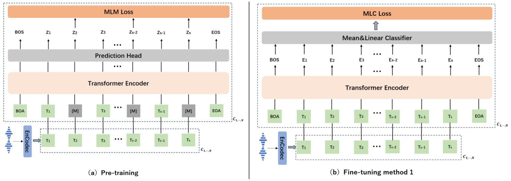
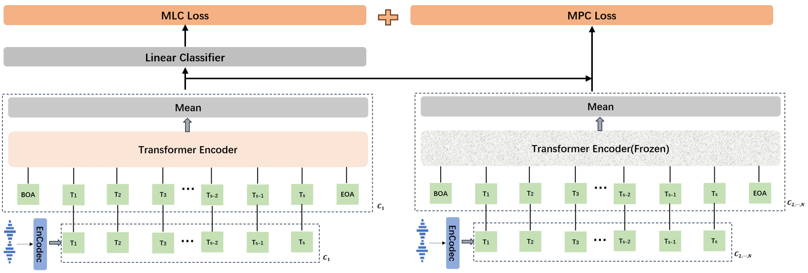
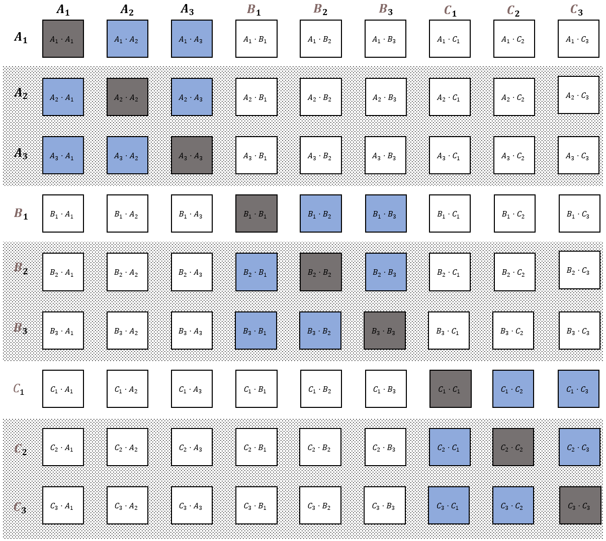
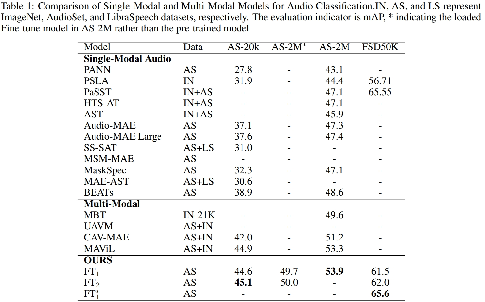

[English](./README_en.md)
# AudioFormer
Audio Transformer learns audio feature representations from discrete acoustic codes
## Pre-train&Fine-tune

## Fine-Tune method 2

## MPC

## result

代码整理中，预计2023年9月发布

