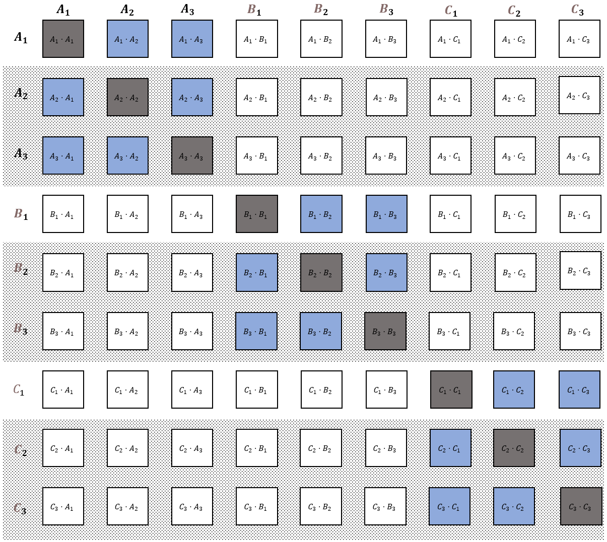
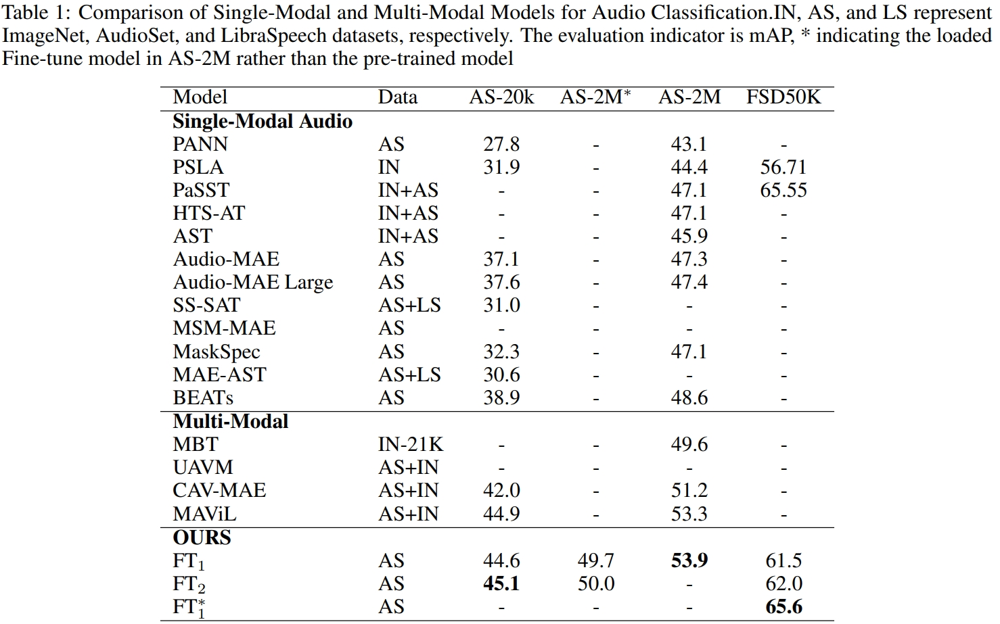

[中文](./README.md)
# AudioFormer
Audio Transformer learns audio feature representations from discrete acoustic codes
## Pre-train&Fine-tune

## Fine-Tune method 2

## MPC

## result

Code organization in progress, expected to be released in September 2023.